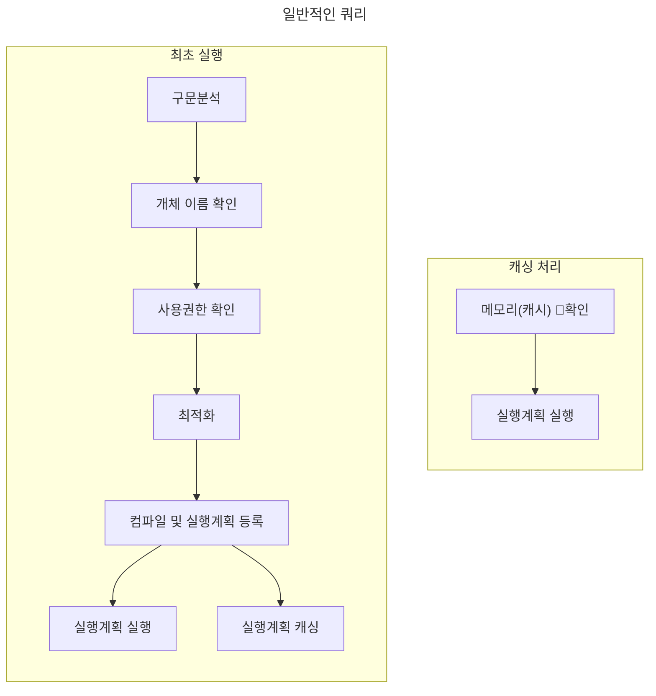
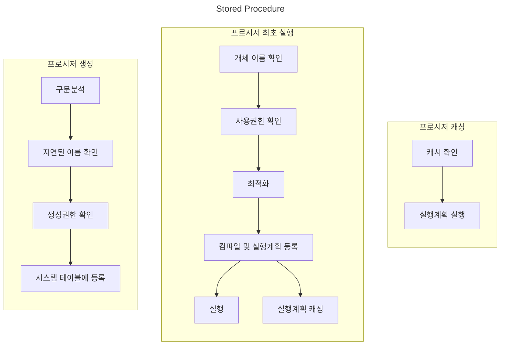

> [!summary] Summary
> - Return을 하지 않는 Function
> - 쿼리 캐싱을 통한 최적화 전략

# Stored Procedure(SP)

1. 일련의 `절차`(Procedure)를 정리해서 `저장`(Stored)해둔 로직이다.
2. Function과는 다르게 Value를 Return하지 않는다.
---
# 특징

1. SP를 사용함으로서 유지보수 및 재활용측면에서 유리하다.
2. 프로시저에 권한을 줄 수 있으므로 보안이 강화된다.
3. 네트워크의 부하를 줄일 수 있다.
4. 구문을 실행가능한 바이너리로 만들고 이 과정을 캐싱하여 성능향상을 할 수 있다.

>[!cue] 캐싱 방식

##### 일반적인 SQL


1. 구문을 분석한다.
2. 해당 개체(Table, 컬럼)이 존재하는지 확인한다.
3. 권한 확인 후 최적화를 진행한다.
4. 컴파일을 하고 실행계획에 등록한뒤, 이를 캐싱한다.
5. 최종적으로 완성된 실행계획을 기준으로 실행한다.
6. 재실행시 캐싱을 통해 바로 1~5가 생략되고 바로 6으로 진행한다.

##### SP



1. 프로시저는 `지연된 이름 확인`이라해서 개체가 존재하는지 체크여부를 실행시점에 진행한다.
	- 테이블이 존재하지 않아도 프로시저를 만들 수 있음
2. 프로시저는 생성/실행 권한이 있다.
3. **information_schema.routines**를 통해서 Function, Procedure를 확인할 수 있다.
4. 프로시저는 **call '프로시저 이름'**를 통해 호출할 수 있다.

>[!cue] 캐싱을 통한 성능향상 ?

```sql title:"쿼리 비교" hl:7
select * from member where name = '정윤성';
select * from member where name = '윤성';

delimiter $$
create procedure select_by_name(in p_name varchar(3))
	begin
		select * from member where name = p_name
	end $$
delimiter ;
```

SP를 사용하지 않고 단순 select한 쿼리의 경우 where조건절이 달라짐에 따라 새롭게 캐싱을 적용하지만, SP는 이 부분이 `변수로 블랙박스` 되어있기에 캐싱을 계속 유지할 수 있다.