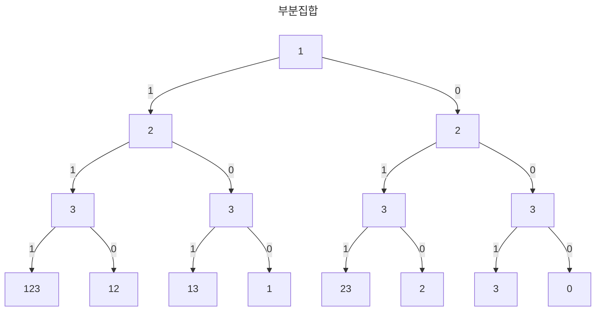

>[!summary] 
>- 

# 부분 집합

집합 A의 모든 원소가 집합B에 속한다면 이는 `부분 집합`이라 한다.

---
# 원리

DFS알고리즘을 사용해 각 원소를 순회하면서 부분집합을 찾아내자


1. 왼쪽이면 1, 오른쪽이면 0으로 해당 값에 대해 마킹 처리를 한다.
	-  예를들어 1의 왼쪽이면 1을 1로 마킹, 2의 왼쪽이면 2를 1로 마킹이다.
2. 이 후 깊이 우선으로 순회하면서 leaf node에 왔을 때 1로 마킹된 값만 출력한다.

---

# 코드
```rust
pub fn subset_dfs(n: usize, vec: &mut Vec<i32>, d: usize) {  
    if d == n {  
        for i in 0..n {  
            if vec[i] == 1 {  
                print!("{} ", i+1);  
            }  
        }  
        println!();  
        return;  
    }  
    vec[d] = 1;  
    subset_dfs(n, vec, d + 1);  
    vec[d] = 0;  
    subset_dfs(n, vec, d + 1);  
}
```
